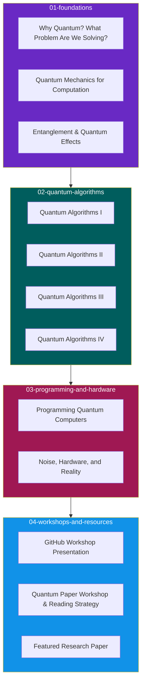

<div align="center">

<!-- Top Video Animation Header -->
<a href="https://www.youtube.com/watch?v=DULa6KbiAxg">
  
</a>

<br/>
<br/>

<!-- Animated Typing SVG Header -->
<a href="https://qiskit.org/">
  
</a>

<br/>
<br/>

[](https://qiskit.org/)
[](https://quantum-computing.ibm.com/)
[](LICENSE)
[]()
[]()

---

### Welcome to the QGSS '26 Master Archive!
*Your ultimate portal into Quantum Computation, Circuit Synthesis, Quantum Algorithms, and Real Hardware Execution.*

</div>

---

## Interactive Folder Navigator

Click on any folder below to expand its contents and access the slides directly:

<details open>
<summary><b>01-foundations/ — Quantum Basics & Entanglement</b></summary>

<br/>

| Lecture Title | Speaker / Instructor | Slide Link |
|---|---|---|
| **Why Quantum? What Problem Are We Solving?** | Roland de Putter | [Slide Deck](./01-foundations/QGSS26_%20Why%20Quantum_%20What%20Problem%20Are%20We%20Solving_%20-%20Roland%20de%20Putter.pdf) |
| **Quantum Mechanics for Computation** | QGSS 2026 Staff | [Slide Deck](./01-foundations/QGSS%202026%20-%20Quantum%20Mechanics%20for%20Computation.pdf) |
| **Entanglement & Quantum Effects** | Thaddeus Pellegrini | [Slide Deck](./01-foundations/QGSS2026_%20Entanglement%20%26%20Quantum%20Effects%20-%20Thaddeus%20Pellegrini.pdf) |

</details>

<br/>

<details open>
<summary><b>02-quantum-algorithms/ — Quantum Algorithms I - IV</b></summary>

<br/>

| Algorithm Module | Speaker / Instructor | Slide Link |
|---|---|---|
| **Quantum Algorithms I** | Will Kirby | [Slide Deck](./02-quantum-algorithms/QGSS26%20-%20Quantum%20Algorithms%20I%20-Will%20Kirby.pdf) |
| **Quantum Algorithms II** | Javier Robledo Moreno | [Slide Deck](./02-quantum-algorithms/QGSS26%20-%20Quantum%20Algorithms%20II%20-%20Javier%20Robledo%20Moreno.pdf) |
| **Quantum Algorithms III** | Minh Tran | [Slide Deck](./02-quantum-algorithms/QGSS26%20-%20Quantum%20Algorithms%20III%20-%20Minh%20Tran.pdf) |
| **Quantum Algorithms IV** | Sabina Dragoi | [Slide Deck](./02-quantum-algorithms/QGSS26%20-%20Quantum%20Algorithms%20IV%20-%20Sabina%20Dragoi.pdf) |

</details>

<br/>

<details open>
<summary><b>03-programming-and-hardware/ — Qiskit & Hardware Reality</b></summary>

<br/>

| Module Title | Speaker / Instructor | Slide Link |
|---|---|---|
| **Programming Quantum Computers** | Ibrahim Shehzad | [Slide Deck](./03-programming-and-hardware/QGSS26_%20Programming%20Quantum%20Computers%20-%20Ibrahim%20Shehzad.pdf) |
| **Noise, Hardware, and Reality** | Haimeng Zhang | [Slide Deck](./03-programming-and-hardware/QGSS26_%20Noise%2C%20Hardware%2C%20and%20Reality%20-%20Haimeng%20Zhang.pdf) |

</details>

<br/>

<details open>
<summary><b>04-workshops-and-resources/ — Workshops & Papers</b></summary>

<br/>

| Resource Title | Resource Type | Link |
|---|---|---|
| **GitHub Workshop Presentation** | Workshop Presentation | [Slide Deck](./04-workshops-and-resources/qgss-github-workshop-pres.pdf) |
| **Quantum Paper Workshop Presentation** | Workshop Presentation | [Slide Deck](./04-workshops-and-resources/qgss-paper-workshop-pres%20(1).pdf) |
| **How to Read a Quantum Paper** | Methodology Guide | [Guide PDF](./04-workshops-and-resources/How%20to%20Read%20a%20Quantum%20Paper.pdf) |
| **Reading Strategy Cheat Sheet** | Reference Sheet | [Cheat Sheet](./04-workshops-and-resources/reading-strategy-cheat-sheet%20(1).pdf) |
| **Guided Practice Excerpt** | Practical Exercise | [Practice PDF](./04-workshops-and-resources/guided-practice-excerpt.pdf) |
| **Featured Quantum Paper** | Research Paper | [arXiv:2603.03496v1](./04-workshops-and-resources/2603.03496v1.pdf) |

</details>

---

## Complete Slide Deck & Resource Catalog

| # | Topic / Slide Title | Speaker / Instructor | Folder Location / Resource | Resource Type |
|---|---|---|---|---|
| **01** | **Why Quantum? What Problem Are We Solving?** | Roland de Putter | [Slide Deck](./01-foundations/QGSS26_%20Why%20Quantum_%20What%20Problem%20Are%20We%20Solving_%20-%20Roland%20de%20Putter.pdf) | Core Lecture Slides |
| **02** | **Quantum Mechanics for Computation** | QGSS 2026 Staff | [Slide Deck](./01-foundations/QGSS%202026%20-%20Quantum%20Mechanics%20for%20Computation.pdf) | Core Lecture Slides |
| **03** | **Entanglement & Quantum Effects** | Thaddeus Pellegrini | [Slide Deck](./01-foundations/QGSS2026_%20Entanglement%20%26%20Quantum%20Effects%20-%20Thaddeus%20Pellegrini.pdf) | Core Lecture Slides |
| **04** | **Quantum Algorithms I** | Will Kirby | [Slide Deck](./02-quantum-algorithms/QGSS26%20-%20Quantum%20Algorithms%20I%20-Will%20Kirby.pdf) | Core Lecture Slides |
| **05** | **Quantum Algorithms II** | Javier Robledo Moreno | [Slide Deck](./02-quantum-algorithms/QGSS26%20-%20Quantum%20Algorithms%20II%20-%20Javier%20Robledo%20Moreno.pdf) | Core Lecture Slides |
| **06** | **Quantum Algorithms III** | Minh Tran | [Slide Deck](./02-quantum-algorithms/QGSS26%20-%20Quantum%20Algorithms%20III%20-%20Minh%20Tran.pdf) | Core Lecture Slides |
| **07** | **Quantum Algorithms IV** | Sabina Dragoi | [Slide Deck](./02-quantum-algorithms/QGSS26%20-%20Quantum%20Algorithms%20IV%20-%20Sabina%20Dragoi.pdf) | Core Lecture Slides |
| **08** | **Programming Quantum Computers** | Ibrahim Shehzad | [Slide Deck](./03-programming-and-hardware/QGSS26_%20Programming%20Quantum%20Computers%20-%20Ibrahim%20Shehzad.pdf) | Core Lecture Slides |
| **09** | **Noise, Hardware, and Reality** | Haimeng Zhang | [Slide Deck](./03-programming-and-hardware/QGSS26_%20Noise%2C%20Hardware%2C%20and%20Reality%20-%20Haimeng%20Zhang.pdf) | Core Lecture Slides |
| **10** | **GitHub Workshop Presentation** | QGSS 2026 Staff | [Slide Deck](./04-workshops-and-resources/qgss-github-workshop-pres.pdf) | Workshop Presentation |
| **11** | **Quantum Paper Workshop Presentation** | QGSS 2026 Staff | [Slide Deck](./04-workshops-and-resources/qgss-paper-workshop-pres%20(1).pdf) | Workshop Presentation |
| **12** | **How to Read a Quantum Paper** | QGSS 2026 Staff | [Guide PDF](./04-workshops-and-resources/How%20to%20Read%20a%20Quantum%20Paper.pdf) | Methodology Guide |
| **13** | **Reading Strategy Cheat Sheet** | QGSS 2026 Staff | [Cheat Sheet](./04-workshops-and-resources/reading-strategy-cheat-sheet%20(1).pdf) | Reference Sheet |
| **14** | **Guided Practice Excerpt** | QGSS 2026 Staff | [Practice PDF](./04-workshops-and-resources/guided-practice-excerpt.pdf) | Practical Exercise |
| **15** | **Featured Quantum Paper** | Research Authors | [arXiv:2603.03496v1](./04-workshops-and-resources/2603.03496v1.pdf) | Research Paper |

---

## Recommended Learning Path

The diagram below maps out the learning curriculum progression mapped directly to the repository folders:



---

## Quickstart: Running Qiskit

To execute quantum circuits corresponding to the lecture algorithms:

```bash
# Create and activate virtual environment
python -m venv qiskit-env
source qiskit-env/bin/activate  # On Windows: qiskit-env\Scripts\activate

# Install Qiskit 2.x ecosystem
pip install "qiskit>=2.0" qiskit-ibm-runtime matplotlib
```

### Basic Bell State Circuit Example

```python
from qiskit import QuantumCircuit
from qiskit.visualization import plot_histogram
from qiskit_aer import AerSimulator

# Create a Quantum Circuit with 2 qubits and 2 classical bits
qc = QuantumCircuit(2, 2)

# Apply Hadamard gate on qubit 0 to create superposition
qc.h(0)

# Apply CNOT gate with control qubit 0 and target qubit 1 to create Entanglement
qc.cx(0, 1)

# Measure qubits
qc.measure([0, 1], [0, 1])

# Simulate execution
simulator = AerSimulator()
result = simulator.run(qc, shots=1000).result()
counts = result.get_counts()

print("Entanglement Measurement Results:", counts)

# Print Qiskit ASCII Circuit
print(qc.draw('text'))
```

#### Generated Qiskit ASCII Circuit Diagram
```text
     ┌───┐     ┌─┐
q_0: ┤ H ├──■──┤M├───
     └───┘┌─┴─┐└╥┘┌─┐
q_1: ─────┤ X ├─╫─┤M├
          └───┘ ║ └╥┘
c: 2/═══════════╩══╩═
                0  1
```

---

## Acknowledgments & Credits

- **Organizers**: [IBM Quantum](https://quantum-computing.ibm.com/) & [Qiskit Community](https://qiskit.org/)
- **Lecturers**: Roland de Putter, Thaddeus Pellegrini, Will Kirby, Javier Robledo Moreno, Minh Tran, Sabina Dragoi, Ibrahim Shehzad, Haimeng Zhang.
- **Repository Maintainer**: QGSS '26 Participant Archive.

---
*Created for the Quantum Computing Community.*
